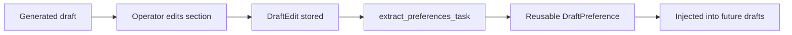

<div align="center">

# Document Intelligence Platform

### Production-grade document processing pipeline — upload to structured export in a single stack

<br/>

[](https://python.org)
[](https://fastapi.tiangolo.com)
[](https://docs.celeryq.dev)
[](https://postgresql.org)
[](https://redis.io)
[](https://docs.docker.com/compose)
[](tests/)
[](LICENSE)

<br/>

```
upload → OCR → classify → extract → line items → LLM enrich → validate → score → review → export
```

```
legal doc → chunk → embed → retrieve evidence → Gemini 2.5 Flash draft → operator edit → learned preference
```

</div>

---

## Overview

Document Intelligence Platform ingests scanned PDFs and images, runs a multi-stage AI pipeline to classify and extract structured data, scores extraction confidence, routes uncertain fields to a human review queue, and exports results as CSV, XLSX, or JSON — all observable via Prometheus/Grafana and manageable through a Streamlit review UI.

Built by surveying 30+ open-source alternatives and commercial platforms (Rossum, Stampli, ABBYY FlexiCapture, MinerU, deepdoctection) to identify what production deployments actually need beyond basic field extraction.

---

## About this project

**Sole developer** — I designed and built the entire platform from scratch,
including architecture decisions, all Python backend code, the Celery worker
pipeline, database schema migrations, Docker Compose setup, Prometheus/Grafana
observability, and all 110 test cases.

**What I implemented:**
- Multi-stage document pipeline: OCR → classify → extract → validate → score → review → export
- Async task queue with Celery, Redis broker, and priority queues
- Fraud / duplicate detection (4-signal: hash, invoice collision, anomaly, velocity)
- Human-in-the-loop review workflow with page-level evidence (bbox, page_number)
- Active learning loop via CorrectionRecord → training data export
- 3-way purchase order matching with fuzzy vendor matching
- Prometheus metrics + Grafana dashboards for full observability
- Docker multi-stage build, non-root user, healthchecks
- 110 pytest tests covering API routes, pipeline, validators, and middleware

**What I learnt:**
- How to design production-grade async pipelines (Celery + Redis + PostgreSQL)
- OCR preprocessing techniques (Tesseract, PaddleOCR, noise normalization)
- Confidence scoring across multiple signals for ML output trustworthiness
- How to structure a multi-module Python project with pyproject.toml and uv
- Prometheus/Grafana observability — what metrics actually matter in production
- Building human-review workflows (HITL) with audit trails and active learning

---

## Product Screenshots

### Dashboard


### Analytics


### Review Queue


---

## Benchmark Results

> **Dataset:** 80 synthetic PDFs — 40 invoices · 40 bank statements · clean / multipage / noisy variants  
> Full methodology: [`evaluation/REPORT.md`](evaluation/REPORT.md) · Raw results: [`evaluation/results.json`](evaluation/results.json)

### Classification Accuracy

| Variant | Accuracy |
|---|---|
| Clean documents | **100%** |
| Multi-page documents | **100%** |
| Noisy / OCR-artefact documents | **100%** |
| **Overall** | **100%** |

### Field Extraction (F1 Score)

| Field | Precision | Recall | F1 |
|---|---|---|---|
| `closing_balance` | 1.000 | 1.000 | **1.000** |
| `invoice_date` | 1.000 | 1.000 | **1.000** |
| `opening_balance` | 1.000 | 1.000 | **1.000** |
| `vendor_name` | 1.000 | 1.000 | **1.000** |
| `invoice_number` | 0.950 | 0.950 | **0.950** |
| `account_number` | 1.000 | 0.925 | **0.961** |
| `customer_name` | 0.900 | 0.675 | **0.771** |
| `subtotal` / `tax` | 1.000 | 0.750 | **0.857** |
| `total_amount` | 0.750 | 0.750 | **0.750** |
| **Macro-average F1** | | | **0.905** |

**Performance:** avg classification latency **0.49 ms** · avg document confidence **0.79**

### Legal RAG + Drafting Evaluation

> **Dataset:** 3 synthetic legal text fixtures and JSON ground-truth cases in
> [`evaluation/dataset/legal_docs/`](evaluation/dataset/legal_docs/) and
> [`evaluation/ground_truth/legal/`](evaluation/ground_truth/legal/).

| Evaluation | Command | Result |
|---|---|---|
| Retrieval | `python evaluation/eval_retrieval.py evaluation/ground_truth/legal/retrieval_cases.json` | Recall@5 **1.000** · MRR **0.750** over 8 cases in the local hash-fallback run |
| Draft groundedness | `python evaluation/eval_drafts.py evaluation/ground_truth/legal/draft_cases.json` | Groundedness **1.000** · unsupported honesty **1.000** · ROUGE-lite **0.681** |
| Improvement loop | `python evaluation/eval_improvement.py evaluation/ground_truth/legal/improvement_cases.json` | edit rate **0.80 → 0.20**, relative drop **75%** |

These are intentionally small, transparent synthetic checks rather than a
claim of broad legal-domain performance. They verify the submission-critical
flows: evidence retrieval, citation-grounded drafts, unsupported-section
honesty, and measurable improvement after operator edits.

Retrieval metrics were measured using `BAAI/bge-base-en-v1.5` embeddings. If
the model is not installed, `eval_retrieval.py` falls back to a deterministic
hash-based embedder which can produce strong scores on lexically clean test
cases but does not reflect production retrieval quality.

---

## Feature Comparison

| Feature | Most OSS Projects | This Platform |
|---|---|---|
| Line item extraction | Header fields only | pdfplumber + regex fallback |
| Duplicate / fraud detection | — | Hash + invoice collision + anomaly + velocity |
| LLM fallback extraction | — | Claude Haiku for null fields |
| Email ingestion (IMAP) | — | Poll + auto-enqueue |
| CSV / Excel export | JSON only | CSV, XLSX, JSON batch |
| PO matching (3-way) | — | PO number + vendor + amount tolerance |
| Page-level review evidence | — | `page_number` + `bbox` + `validation_reason` |
| Cross-field consistency scoring | — | subtotal+tax≈total, closing≈available |
| Field format validators | — | Dates, amounts, IBAN, invoice ID patterns |
| Active learning feedback loop | — | `CorrectionRecord` + export endpoint |
| Tenant-aware access controls | — | Tenant-scoped document, review, PO, dedup, and export routes |
| Request rate limiting | Proxy-only | App-level per-minute limits (in-memory + Redis) |
| HTTP request metrics | — | Prometheus counters + latency histograms on every request |
| Priority processing queues | — | Normal / high / webhooks |

---

## Architecture

```
Client
  │
  ▼
FastAPI  /api/v1
  ├── POST   /documents/upload                → 202 Accepted, enqueues Celery task
  ├── POST   /documents/upload/batch          → batch upload
  ├── GET    /documents                       → paginated + filtered list
  ├── GET    /documents/search?q=             → filename + OCR text search
  ├── GET    /documents/{id}/result           → extraction + line items + validation
  ├── GET    /documents/{id}/status           → lightweight poll
  ├── GET    /documents/{id}/history          → full audit trail
  ├── POST   /documents/{id}/reprocess        → re-run pipeline
  ├── DELETE /documents/{id}                  → soft delete
  │
  ├── GET    /reviews/pending                 → tasks with page_number + bbox + validation_reason
  ├── POST   /reviews/{id}/decision           → submit correction (stored for active learning)
  │
  ├── POST   /purchase-orders                 → register a PO
  ├── GET    /purchase-orders                 → list POs
  ├── POST   /purchase-orders/match/{id}      → run 3-way PO match
  ├── GET    /purchase-orders/match/{id}      → get match result
  │
  ├── POST   /deduplication/{id}/check        → hash + collision + anomaly + velocity check
  │
  ├── GET    /exports/csv                     → flat CSV download
  ├── GET    /exports/xlsx                    → styled Excel workbook
  ├── GET    /exports/json                    → full extraction payloads
  │
  ├── GET    /analytics/metrics/overview      → per-tenant document counts + confidence
  ├── GET    /analytics/corrections           → tenant-scoped reviewer corrections
  ├── GET    /analytics/corrections/stats     → field failure statistics
  ├── GET    /analytics/audit/tenant          → tenant-scoped audit log
  │
  ├── POST   /webhooks                        → register (HMAC-SHA256 signed)
  └── GET    /health/live  /health/ready
  │
  ▼
Celery Workers
  ├── documents.high    — dedicated priority queue
  ├── documents.normal  — 2 replicas × 4 concurrency
  ├── webhooks          — 8 concurrency
  └── poll_email_task   — scheduled IMAP polling (when configured)
       │
       ▼
  DocumentPipeline
    1. OCR          (Tesseract | PaddleOCR)
    2. Normalize    (OCR artefact cleaning)
    3. Classify     (TF-IDF + regex + fuzzy keyword — 4 document types)
    4. Extract      (invoice | bank_statement | receipt | contract)
    5. Line Items   (pdfplumber tables → regex fallback)
    6. LLM Enrich   (Claude Haiku — optional, null fields only)
    7. Validate     (dates, amounts, IBAN, cross-field consistency)
    8. Score        (5-signal: extraction + OCR + classifier + format + consistency)
    9. Review       (low-confidence → ReviewTask with page evidence)
  │
  ▼
PostgreSQL · Redis · Local/S3 Storage
  │
  ▼
Prometheus · Grafana · Celery Flower · Streamlit Review UI
```

### Legal RAG + Drafting

The legal drafting layer adds:

- `document_chunks` with pgvector embeddings for section-aware legal text chunks
- `draft_outputs` for generated legal prose with evidence chunk IDs
- `draft_edits` for operator corrections
- `draft_preferences` for learned reusable drafting rules

Draft generation uses **Gemini 2.5 Flash** (`DRAFT_MODEL=gemini-2.5-flash`) and
retrieves document evidence before generation. The model is instructed to cite
source pages inline and to mark missing information as `[UNSUPPORTED: reason]`
instead of inferring.

### Improvement Loop



This closes the loop between review and future generation: edits become
tenant-scoped preferences that are applied to later drafts of the same document
type.

---

## Installation

### Prerequisites

| Tool | Minimum Version | Purpose |
|---|---|---|
| [Docker Desktop](https://docs.docker.com/get-docker/) | 24+ | Full stack via Compose |
| [Python](https://python.org/downloads/) | 3.11+ | Local / bare-metal run |
| [uv](https://docs.astral.sh/uv/getting-started/installation/) | 0.4+ | Fast Python package manager |
| [Tesseract OCR](https://tesseract-ocr.github.io/tessdoc/Installation.html) | 4.1+ | OCR engine (bare-metal only) |

---

### Option 1 — Docker Compose (Recommended)

The fastest way to get the full stack — API, workers, PostgreSQL, Redis, MinIO, Prometheus, Grafana, and the Streamlit review UI — running locally.

**Step 1 — Clone and configure**

```bash
git clone <your-repo-url>
cd END-TO-END-main
cp .env.example .env        # Docker Compose uses service hostnames (postgres, redis)
```

**Step 2 — Start all services**

```bash
docker compose up --build -d
```

**Step 3 — Apply database migrations**

```bash
docker compose exec api alembic upgrade head
```

**Step 4 — Run the demo** *(optional)*

```bash
bash scripts/demo_run.sh
```

**Step 5 — Stop when done**

```bash
docker compose down          # stop only
docker compose down -v       # stop + delete all data volumes
```

<details>
<summary><strong>Service URLs</strong></summary>

| Service | URL | Credentials |
|---|---|---|
| API + Frontend | http://localhost:8000 | — |
| Swagger / OpenAPI | http://localhost:8000/docs | — |
| Prometheus metrics | http://localhost:8000/metrics | — |
| Celery Flower | http://localhost:5555 | — |
| Grafana | http://localhost:3000 | admin / admin |
| MinIO Console | http://localhost:9001 | minioadmin / minioadmin |
| Streamlit Review UI | http://localhost:8501 | — |

</details>

---

### Option 2 — Local Bare-Metal (uv)

Run FastAPI and Celery directly on your machine without Docker. Requires PostgreSQL and Redis running locally.

#### 2a — System dependencies

**macOS (Homebrew)**

```bash
brew install tesseract poppler postgresql@16 redis
brew services start postgresql@16
brew services start redis
createdb docintel
```

**Ubuntu / Debian**

```bash
sudo apt-get update
sudo apt-get install -y tesseract-ocr tesseract-ocr-eng libtesseract-dev \
    poppler-utils libglib2.0-0 libsm6 libxext6 libxrender1 \
    postgresql postgresql-client redis-server
sudo systemctl start postgresql redis-server
sudo -u postgres createdb docintel
```

**Windows**

- Install Tesseract via the [UB Mannheim installer](https://github.com/UB-Mannheim/tesseract/wiki)
- Install PostgreSQL via [EDB installer](https://www.enterprisedb.com/downloads/postgres-postgresql-downloads)
- Install Redis via [Memurai](https://www.memurai.com/) or WSL2
- Add Tesseract to `PATH`

#### 2b — Python environment

```bash
# Install uv (if not already installed)
curl -LsSf https://astral.sh/uv/install.sh | sh

# Create a Python 3.11 virtual environment
uv venv .venv --python 3.11

# Activate the environment
source .venv/bin/activate          # macOS / Linux
# .\.venv\Scripts\Activate.ps1    # Windows PowerShell
```

#### 2c — Install dependencies

```bash
# Core application + development tools
uv pip install -e ".[dev]"

# Download the required spaCy language model
python -m spacy download en_core_web_sm
```

<details>
<summary><strong>Optional extras</strong></summary>

```bash
# PaddleOCR (better accuracy on noisy/scanned docs, heavier footprint)
uv pip install -e ".[paddle]"

# LayoutLM / Donut (transformer-based extraction, requires GPU recommended)
uv pip install -e ".[ml]"
```

</details>

#### 2d — Configure environment

```bash
cp .env.localhost.example .env
```

Edit `.env` and verify:
- `DATABASE_URL` points to your local PostgreSQL instance
- `CELERY_BROKER_URL` / `CELERY_RESULT_BACKEND` point to your local Redis

#### 2e — Apply migrations

```bash
alembic upgrade head
```

#### 2f — Start services

Open **three terminals** in the project root with the venv active:

**Terminal 1 — API server**

```bash
uvicorn app.main:app --reload --host 0.0.0.0 --port 8000
```

**Terminal 2 — Celery worker**

```bash
celery -A app.workers.celery_app.celery_app worker \
    --loglevel=INFO \
    --queues=documents.normal,documents.high \
    --concurrency=4
```

**Terminal 3 — Streamlit Review UI** *(optional)*

```bash
REVIEW_API_BASE=http://localhost:8000/api/v1 \
    streamlit run review_ui/streamlit_app.py --server.port 8501
```

The API is now available at `http://localhost:8000/docs`.

---

### Option 3 — Production-like with Docker (multi-replica)

```bash
docker compose up --build -d --scale worker=3
docker compose exec api alembic upgrade head
```

For actual production, replace the in-memory rate limiter with the Redis-backed one by setting `REDIS_RATE_LIMIT_URL` in `.env` and pointing to a shared Redis instance accessible from all API replicas.

---

## Configuration Reference

All settings are loaded from the `.env` file. Copy the appropriate template and edit:

```bash
cp .env.example .env            # Docker Compose
cp .env.localhost.example .env  # bare-metal local
```

<details>
<summary><strong>Full configuration table</strong></summary>

| Variable | Default | Description |
|---|---|---|
| `APP_NAME` | `Document Intelligence Platform` | Application name in API metadata |
| `APP_ENV` | `local` | `local` \| `production` |
| `DEBUG` | `false` | Enable debug mode and traceback responses |
| `LOG_LEVEL` | `INFO` | `DEBUG` \| `INFO` \| `WARNING` \| `ERROR` |
| `PIPELINE_VERSION` | `0.3.0` | Stamped on every extraction result |
| `API_V1_PREFIX` | `/api/v1` | URL prefix for all versioned routes |
| `ALLOWED_ORIGINS` | `*` | Comma-separated CORS origins. Set explicitly in production |
| `DATABASE_URL` | `postgresql+psycopg://...` | SQLAlchemy connection string |
| `DB_POOL_SIZE` | `10` | SQLAlchemy connection pool size |
| `DB_MAX_OVERFLOW` | `20` | Max connections above pool size |
| `CELERY_BROKER_URL` | `redis://localhost:6379/0` | Celery broker |
| `CELERY_RESULT_BACKEND` | `redis://localhost:6379/1` | Celery result backend |
| `CELERY_TASK_SOFT_TIME_LIMIT` | `300` | Seconds before task receives SoftTimeLimitExceeded |
| `CELERY_TASK_TIME_LIMIT` | `600` | Hard timeout (seconds) |
| `STORAGE_BACKEND` | `local` | `local` \| `s3` |
| `UPLOAD_DIR` | `data/uploads` | Local upload directory |
| `EXPORT_DIR` | `data/exports` | Local export directory |
| `S3_ENDPOINT_URL` | *(empty)* | S3-compatible endpoint (MinIO, AWS, etc.) |
| `S3_ACCESS_KEY_ID` | *(empty)* | S3 access key |
| `S3_SECRET_ACCESS_KEY` | *(empty)* | S3 secret key |
| `S3_BUCKET_UPLOADS` | `docintel-uploads` | Bucket for uploaded files |
| `S3_BUCKET_EXPORTS` | `docintel-exports` | Bucket for exported files |
| `OCR_ENGINE` | `tesseract` | `tesseract` \| `paddle` |
| `SPACY_MODEL` | `en_core_web_sm` | spaCy model for entity extraction |
| `LOW_CONFIDENCE_THRESHOLD` | `0.75` | Fields below this score are routed to review |
| `MAX_UPLOAD_SIZE_MB` | `50` | Maximum upload file size |
| `API_KEYS` | *(empty)* | Comma-separated valid API keys. Empty = auth disabled |
| `API_KEY_HEADER` | `X-API-Key` | Header name for API key authentication |
| `RATE_LIMIT_ENABLED` | `true` | Enable app-level rate limiting |
| `RATE_LIMIT_UPLOAD_PER_MINUTE` | `30` | Upload endpoint rate limit |
| `RATE_LIMIT_DEFAULT_PER_MINUTE` | `120` | Default endpoint rate limit |
| `REDIS_RATE_LIMIT_URL` | *(empty)* | Set to enable Redis-backed rate limiter (multi-replica) |
| `CACHE_TTL_SECONDS` | `300` | Response cache TTL |
| `WEBHOOK_MAX_RETRIES` | `3` | Webhook delivery retry attempts |
| `WEBHOOK_TIMEOUT_SECONDS` | `10` | Per-request webhook timeout |
| `LLM_EXTRACTION_ENABLED` | `false` | Enable Claude Haiku fallback extraction |
| `ANTHROPIC_API_KEY` | *(empty)* | Required when `LLM_EXTRACTION_ENABLED=true` |
| `EMAIL_IMAP_HOST` | *(empty)* | IMAP host for email ingestion |
| `EMAIL_IMAP_PORT` | `993` | IMAP port |
| `EMAIL_ADDRESS` | *(empty)* | Mailbox address |
| `EMAIL_PASSWORD` | *(empty)* | App password or IMAP password |
| `EMAIL_FOLDER` | `INBOX` | Folder to poll |
| `EMAIL_MAX_ATTACHMENTS_PER_RUN` | `50` | Maximum attachments processed per poll cycle |

</details>

---

## API Reference

Interactive documentation is available at `http://localhost:8000/docs` (Swagger UI) and `http://localhost:8000/redoc`.

### Authentication

When `API_KEYS` is set, all endpoints require the `X-API-Key` header:

```bash
curl -H "X-API-Key: your-key" http://localhost:8000/api/v1/documents
```

Leave `API_KEYS` empty in `.env` to disable authentication for local development.

### Multi-tenancy

Pass `X-Tenant-ID` to scope all reads and writes to a specific tenant:

```bash
curl -H "X-Tenant-ID: acme-corp" http://localhost:8000/api/v1/documents
```

### Core workflows

<details>
<summary><strong>Upload and process a document</strong></summary>

```bash
# Single file upload (returns 202 + task ID immediately)
curl -X POST http://localhost:8000/api/v1/documents/upload \
  -F "file=@invoice.pdf"

# High-priority queue
curl -X POST "http://localhost:8000/api/v1/documents/upload?priority=true" \
  -F "file=@urgent.pdf"

# Batch upload
curl -X POST http://localhost:8000/api/v1/documents/upload/batch \
  -F "files=@invoice1.pdf" \
  -F "files=@invoice2.pdf"

# Poll status
curl http://localhost:8000/api/v1/documents/{id}/status

# Get extraction result
curl http://localhost:8000/api/v1/documents/{id}/result | python3 -m json.tool
```

</details>

<details>
<summary><strong>Export results</strong></summary>

```bash
# Flat CSV (ready for Excel or accounting systems)
curl "http://localhost:8000/api/v1/exports/csv?document_type=invoice&status=completed" \
  -o invoices.csv

# Styled Excel workbook with frozen header row
curl http://localhost:8000/api/v1/exports/xlsx -o documents.xlsx

# Full extraction payloads as JSON array
curl http://localhost:8000/api/v1/exports/json -o batch.json
```

</details>

<details>
<summary><strong>Purchase order matching (3-way)</strong></summary>

```bash
# Register a PO
curl -X POST http://localhost:8000/api/v1/purchase-orders \
  -H "Content-Type: application/json" \
  -d '{"po_number":"PO-2024-001","vendor_name":"Acme Ltd","total_amount":1200.0}'

# Match an uploaded invoice against registered POs
curl -X POST http://localhost:8000/api/v1/purchase-orders/match/{document_id}
```

Match scoring: PO number exact match (40 pts) + vendor fuzzy match (30 pts) + amount ±1% tolerance (30 pts).
Result: `matched` (≥85%) · `partial` (50–85%) · `unmatched`.

</details>

<details>
<summary><strong>Duplicate and fraud detection</strong></summary>

```bash
curl -X POST http://localhost:8000/api/v1/deduplication/{id}/check
```

Returns a risk report with four independent signals:

| Signal | Trigger |
|---|---|
| `exact_duplicate` | Byte-for-byte SHA-256 hash match |
| `invoice_number_collision` | Same invoice number already in database |
| `amount_anomaly` | Total >3σ from vendor historical mean (min 5 invoices) |
| `vendor_velocity` | Vendor submitted >20 invoices in last 24 hours |

Risk levels: `clean` · `low` · `medium` · `high`

</details>

<details>
<summary><strong>Human review workflow</strong></summary>

```bash
# List tasks needing review (includes page number + bbox + validation reason)
curl http://localhost:8000/api/v1/reviews/pending | python3 -m json.tool

# Submit a correction
curl -X POST http://localhost:8000/api/v1/reviews/{task_id}/decision \
  -H "Content-Type: application/json" \
  -d '{"decision":"corrected","corrected_value":"INV-2024-001","reviewer":"analyst","comment":"OCR misread digit"}'
```

</details>

<details>
<summary><strong>Webhooks (HMAC-SHA256 signed)</strong></summary>

```bash
# Register a webhook endpoint
curl -X POST http://localhost:8000/api/v1/webhooks \
  -H "Content-Type: application/json" \
  -d '{"url":"https://your.server/hook","events":["processing_completed","review_required"]}'
```

Events fired: `processing_completed` · `processing_failed` · `review_required`

Each request includes an `X-Signature-SHA256` header for payload verification.

</details>

<details>
<summary><strong>Active learning — corrections export</strong></summary>

```bash
# Export corrections as labelled training data
curl "http://localhost:8000/api/v1/analytics/corrections?document_type=invoice"

# Field failure statistics
curl http://localhost:8000/api/v1/analytics/corrections/stats
```

</details>

---

## Extraction Output Schema

```json
{
  "document_type": "invoice",
  "schema_version": "2.0",
  "source_file": "invoice_001.pdf",
  "fields": {
    "invoice_number": "INV-001",
    "invoice_date": "2025-08-01",
    "vendor_name": "Acme Supplies Ltd",
    "customer_name": "Northwind Retail LLC",
    "subtotal": 1000.0,
    "tax": 200.0,
    "total_amount": 1200.0
  },
  "line_items": [
    {
      "description": "Consulting Services",
      "quantity": 5,
      "unit_price": 200.0,
      "line_total": 1000.0
    }
  ],
  "field_confidences": [
    {
      "name": "invoice_number",
      "value": "INV-001",
      "confidence": 0.92,
      "requires_review": false
    }
  ],
  "document_confidence": 0.89,
  "validation_results": [
    {
      "field": "total_amount",
      "valid": true,
      "reason": null
    }
  ]
}
```

---

## Running Tests

```bash
# All tests
pytest -v --tb=short

# With coverage report
pytest --cov=app --cov-report=term-missing

# Single test file
pytest tests/test_validators.py -v
```

| Test File | Cases | Coverage |
|---|---|---|
| `test_documents_api.py` | 9 | Upload, list, search, detail, delete, reprocess |
| `test_review_api.py` | 5 | Review queue, decision submission |
| `test_webhooks_api.py` | 5 | Registration, HMAC signing |
| `test_extractor_pipeline.py` | 9 | Invoice + bank statement extraction |
| `test_classifier.py` | 9 | All four document types |
| `test_confidence.py` | 8 | Field and document scoring |
| `test_validators.py` | 18 | Dates, amounts, IBAN, cross-field |
| `test_analytics_api.py` | 7 | Metrics, corrections, audit |
| `test_new_features.py` | 12 | PO matching, dedup, exports |
| `test_http_runtime.py` | 11 | Rate limiting, metrics middleware |
| `test_startup_smoke.py` | 3 | App import, route count, health |
| **Total** | **110** | |

---

## Database Migrations

```bash
alembic upgrade head         # apply all pending migrations
alembic current              # check current state
alembic history              # show migration history
alembic downgrade -1         # rollback one step
```

| Migration | Adds |
|---|---|
| `0001_initial_schema` | Core tables: `documents`, `extraction_results`, `review_tasks`, `review_decisions`, `audit_logs` |
| `0002_add_evidence_corrections_utc` | Page evidence on review tasks, `CorrectionRecord`, UTC timestamps |
| `0003_add_po_matching_deduplication` | `PurchaseOrder` + `POMatch` tables |
| `0004_add_correlation_id_and_dead_letter` | Correlation IDs, dead-letter support |

---

## Observability

Prometheus metrics are exported at `GET /metrics`. Key metrics:

| Metric | Type | Description |
|---|---|---|
| `docintel_http_requests_total` | Counter | Request count by method, path, status |
| `docintel_http_request_duration_seconds` | Histogram | Request latency by method, path |
| `docintel_documents_uploaded_total` | Counter | Uploads by tenant |

Import the included Grafana provisioning from `infra/grafana/provisioning/` or connect Grafana to the Prometheus instance at `http://prometheus:9090`.

Rate limit headers are returned on every request:

```
X-RateLimit-Limit: 120
X-RateLimit-Remaining: 119
X-RateLimit-Reset: 42
```

---

## LLM Fallback Extraction

When enabled, fields that could not be extracted by the deterministic pipeline are sent to Claude Haiku for recovery. Only `null` fields are re-extracted — deterministic results are never overwritten.

```env
LLM_EXTRACTION_ENABLED=true
ANTHROPIC_API_KEY=sk-ant-...
```

---

## Email Ingestion (IMAP)

Configure to automatically poll a mailbox and enqueue PDF attachments:

```env
EMAIL_IMAP_HOST=imap.gmail.com
EMAIL_ADDRESS=ap@yourcompany.com
EMAIL_PASSWORD=your-app-password
EMAIL_FOLDER=INBOX
EMAIL_MAX_ATTACHMENTS_PER_RUN=50
```

The Celery beat schedule for polling (every 5 minutes):

```python
celery_app.conf.beat_schedule = {
    "poll-email": {
        "task": "app.workers.tasks.poll_email_task",
        "schedule": 300.0
    }
}
```

---

## Project Structure

```
├── app/
│   ├── api/v1/routes/      — FastAPI route handlers
│   ├── classification/     — TF-IDF + regex + fuzzy document classifier
│   ├── core/               — config, logging, metrics, rate limiter
│   ├── db/                 — SQLAlchemy models + session
│   ├── extraction/         — per-type extractors (invoice, bank_statement, receipt, contract)
│   ├── ocr/                — OCR providers (Tesseract, PaddleOCR) + factory
│   ├── pipelines/          — document pipeline + confidence scorer
│   ├── schemas/            — Pydantic request/response models
│   ├── services/           — business logic (document, review, PO, dedup, export, LLM, webhook)
│   ├── storage/            — storage backends (local, S3) + factory
│   ├── utils/              — validators, text normalisation, PDF utilities
│   └── workers/            — Celery app + task definitions
├── alembic/                — database migrations
├── evaluation/             — benchmark scripts, dataset, ground truth, results
├── frontend/               — single-file HTML frontend (served by FastAPI)
├── infra/                  — Prometheus config, Grafana provisioning
├── review_ui/              — Streamlit human-review interface
├── sample_docs/            — sample PDFs for quick testing
├── scripts/                — demo, evaluation, calibration, retrain scripts
├── tests/                  — 110 pytest tests
├── docker-compose.yml
├── Dockerfile              — multi-stage, non-root user, healthcheck
└── pyproject.toml
```

---

## Known Limitations

| Limitation | Planned Fix |
|---|---|
| Rate limiter uses a fixed window — susceptible to boundary burst | Sliding window / token bucket via Redis (redis-cell) |
| In-memory rate limiter does not share state across replicas | Set `REDIS_RATE_LIMIT_URL` to enable the Redis-backed limiter |
| `subtotal` recall = 85.7% | Layout variation; derive from line-item sum when direct extraction fails |
| No OAuth/JWT authentication | Static API keys are adequate for single-tenant deployments |
| Synthetic evaluation dataset only | SROIE / FUNSD benchmark integration planned |

---

## Roadmap

- [ ] Sliding-window Redis rate limiter
- [ ] CI/CD pipeline (GitHub Actions — pytest, ruff, mypy, docker build)
- [ ] LayoutLMv3 / Donut fine-tune for noisy document extraction
- [ ] SROIE and FUNSD public benchmark evaluation
- [ ] JWT / OAuth2 tenant authentication
- [ ] OpenTelemetry distributed tracing
- [ ] Idempotent re-upload (SHA-256 content deduplication at ingest)

---

## License

MIT — see [LICENSE](LICENSE) for details.
